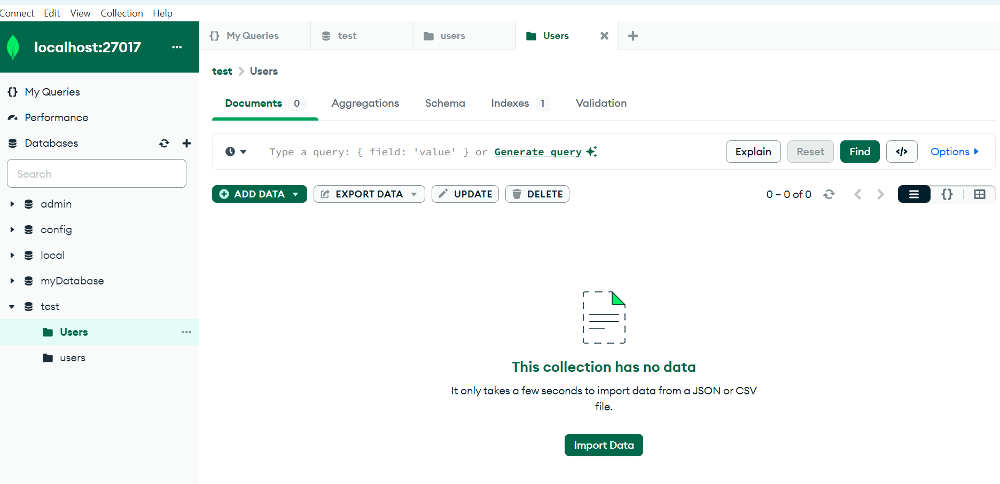
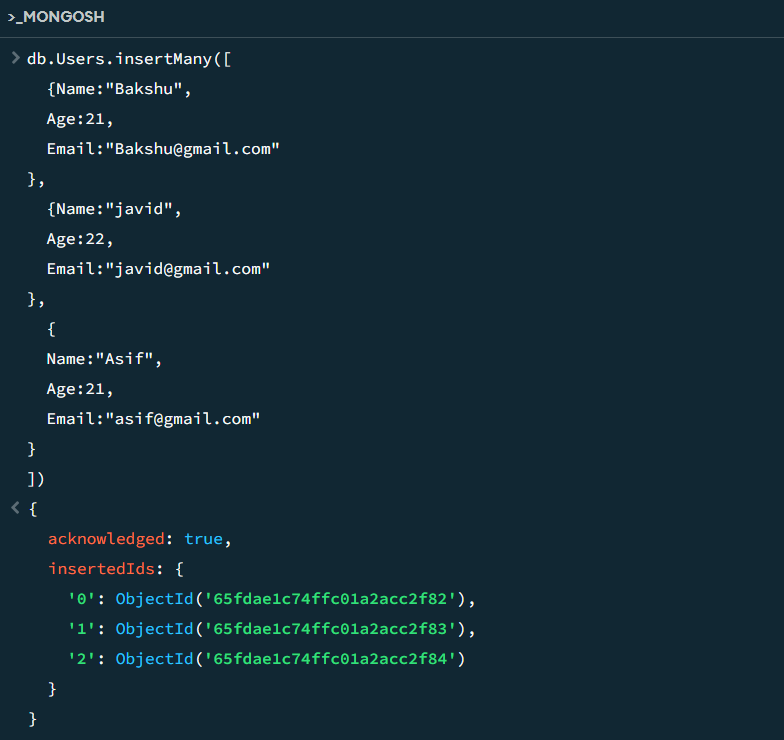
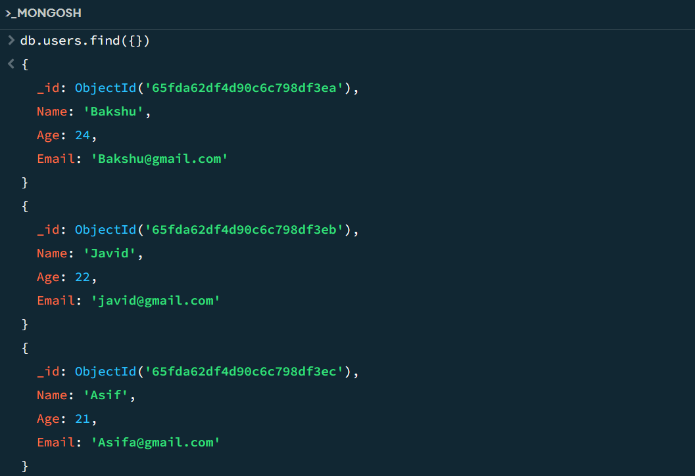
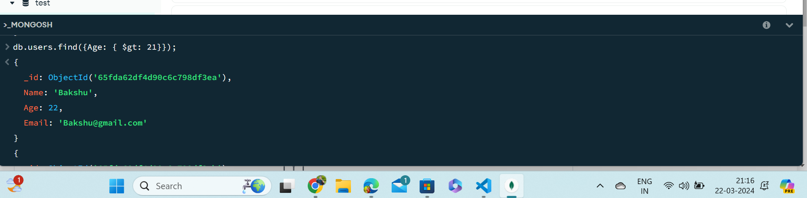
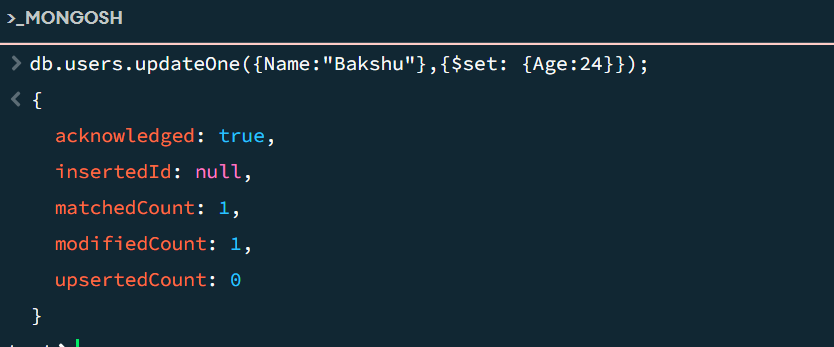
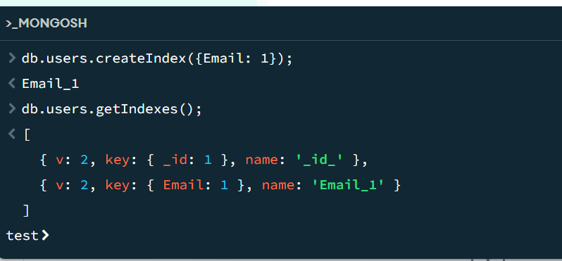
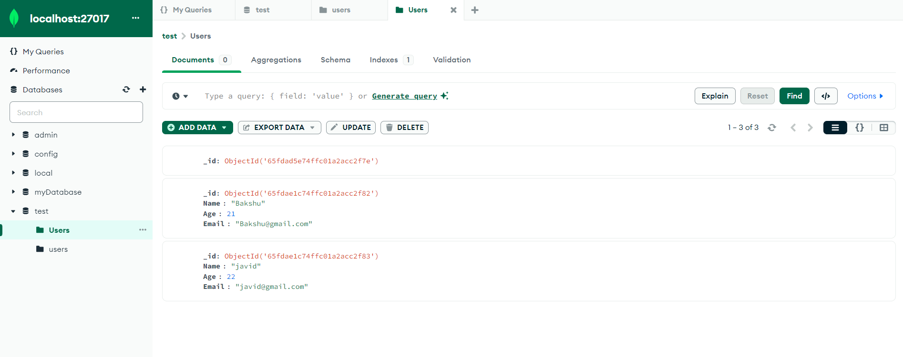

# Assignment - 4
Creating a Database Using MongoDB and Mongosh

1. Database Setup
- Open the mongoDB compass 
- Create a new MongoDB database: myDatabase  
 
2.	Collection Creation:  
- Create a collection within database: users  

3.	Document Insertion: 
-	Insert five documents into the users collection, each representing a user with fields such as name, email, and age. 
-	Before inserting into collection “use db” command to switch the current database context within MongoDB. 
-	db.users.insertMany() method is used to insert the documents into users collection as shown below. 

4.	Queries to retrieve:  
-	To retrieve all the users from the users collection.  o db.users.find({ }); 

-	To retrieve the specific users with an age greater than or equal to 
30 o db.users.find({ Age: { $gte: 30 } });  

5.	Update Operation:  
-	To update the age of a user with a specific email address in MongoDB, use the updateOne() method.  
-	Example: 
o Db.users.updateOne( 
	   	 	{ Name: "Bakshu" }, 
	   	 	{ $set: { Age: 24 } } 
	 	); 

6.	Deletion Operation:  
-	To delete the user document based on a specific email address in MongoDB, you can use the deleteOne() method. 
db.users.deleteOne({Email: asif@gmail.com});

7.	Index Creation: 
- To create an index on the email field of the users collection in MongoDB, use the db.users.createIndex() method. 
    - db.users.createIndex({ Email: 1 }); 

## Final Outcome: 
